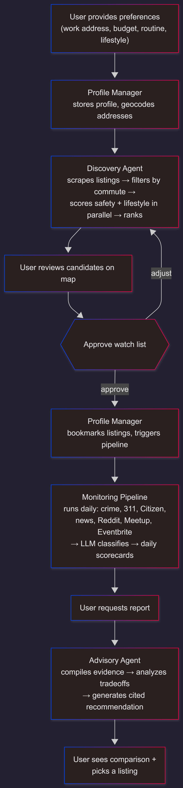

# Vicinity: Real-Time Spatial Intelligence Platform for Urban Housing Decisions

| Resource | Link |
|----------|------|
| Codelabs | [Codelabs Document]() |
| Video Presentation | [Video Demo]() |

## DAMG 7245 — Big Data and Intelligent Analytics

**Team Members**

| Member | Contribution |
|--------|-------------|
| Anirudh Acharya | 33.3% |
| Minal Naranje | 33.3% |
| Janhavi Patil | 33.3% |

**Attestation:** WE ATTEST THAT WE HAVEN'T USED ANY OTHER STUDENTS' WORK IN OUR ASSIGNMENT AND ABIDE BY THE POLICIES LISTED IN THE STUDENT HANDBOOK.

---

## 1. Introduction

### 1.1 Background

Every year, roughly 50,000 people move to Boston for work or school. They pick apartments from Craigslist or Zillow based on price, photos, and a Walk Score — with no visibility into whether the commute route has had violent incidents at the hours they travel, whether the building has a history of 311 rodent complaints, or whether the neighborhood actually has the lifestyle amenities they care about.

Crime data, complaint records, transit schedules, community sentiment, and real-time incident feeds all exist as public data. But they are fragmented across 10+ sources with different schemas, update frequencies, and coordinate systems. No platform combines them into a spatial assessment tied to a specific person's routine and preferences.

### 1.2 Objective

Build a platform that takes a user's work address, budget, routine, and lifestyle preferences, finds apartment listings that fit, scores each listing across safety, livability, commute, and lifestyle dimensions using live public data, monitors the top candidates over a configurable watch period, and generates a comparison report recommending the best fit — backed by accumulated evidence and tradeoff analysis.

### 1.3 The Watch Period

The central idea behind is that you should not sign a lease based on a single snapshot. The user bookmarks 3-5 candidate listings and sets a watch period — 1 week, 2 weeks, a month. During that window, Airflow DAGs run daily in the background: fetching new crime incidents along each listing's commute corridors, new 311 complaints near each listing, new Citizen App real-time events, Reddit and news mentions of each neighborhood, and Meetup/Eventbrite activity matching the user's lifestyle preferences. Every day, a scorecard row is written to Snowflake for each listing. At the end of the watch period, the user asks for the comparison report. The Report Generator reads the full history of daily scorecards, compares all listings across every dimension with trends over time, and produces a justified recommendation. The user decides based on 14 days of accumulated evidence, not today's data.

Deliverables:
- Multi-source data ingestion pipeline (10 sources, Airflow-orchestrated)
- LLM-powered classification of crime severity, news sentiment, and lifestyle preference matching
- LangGraph agentic workflow with parallel listing search, daily monitoring, and report generation
- MCP server for cross-client access with persistent user profiles
- Streamlit dashboard with interactive map and comparison reports

---

## 2. Project Overview

### 2.1 Scope

**In scope:**
- Apartment listing scraping (Craigslist)
- Safety scoring using crime incidents (Boston PD, Citizen App) filtered along actual commute routes
- Livability scoring using 311 complaint history near each listing
- Lifestyle matching using Overpass amenities, Meetup events, Google Places ratings, Reddit/News sentiment
- Commute computation via Google Maps Directions API (transit routing)
- Daily scorecard accumulation over a user-defined watch period
- LLM-generated comparison report with tradeoff analysis
- MCP server wrapping all tools

**Out of scope:**
- Lease signing or payment processing
- Real-time push notifications (mobile)
- Multi-city expansion beyond Greater Boston

### 2.2 Stakeholders / End Users

Anyone searching for housing in Boston — students, new hires, relocating professionals, healthcare workers with irregular schedules. The system is schedule-aware: a nurse working night shifts gets safety scoring filtered to 2 AM, not 2 PM.

---

## 3. Problem Statement

### 3.1 Current Challenges

- **Data fragmentation:** Crime data sits in Boston's CKAN portal, real-time incidents in Citizen App, complaints in a separate 311 dataset, transit in MBTA, amenities in OpenStreetMap. No platform merges them.
- **No route-level safety:** Existing platforms show neighborhood-level crime stats. A listing 500m from a dangerous corridor looks "safe" in aggregate. Our system scores the actual route the user walks or rides, at the hours they travel.
- **No temporal monitoring:** A listing might look fine today. Two weeks of daily data accumulation reveals a rising crime trend or new rodent complaints that a snapshot misses.
- **No lifestyle personalization:** "I like Korean food" is not a Zillow filter. The system needs to understand arbitrary lifestyle preferences and find matching venues, events, and community sentiment near each listing.

### 3.2 Opportunities

- 10 confirmed public data sources with live endpoints (validated with test scripts)
- LLM classification turns unstructured data (news headlines, Reddit posts, crime descriptions) into structured preference-matched signals
- Spatial filtering along route geometry (not just radius) provides safety assessment no existing platform offers
- Daily scorecard accumulation over a watch period gives temporal intelligence for confident decision-making

---

## 4. Methodology

### 4.1 Data Sources

| Source | Records | Update Frequency | Key Fields | API |
|--------|---------|-----------------|------------|-----|
| Boston PD Crime | 257,954 | Daily (1-2 day lag) | OFFENSE_DESCRIPTION, OCCURRED_ON_DATE, HOUR, STREET, Lat, Long, SHOOTING | CKAN datastore_search |
| 311 Complaints | 267,187 | Daily | type, open_dt, case_title, neighborhood, latitude, longitude | CKAN datastore_search |
| Citizen App | ~15-50 per query | Real-time (minutes) | title, latitude, longitude, severity, level, timestamp, address | Trending API (bbox) |
| Craigslist | ~300 per search | Scraped Mon/Thu | url, price, bedrooms, description, lat, lon, address, posted_date | HTML scrape + parse |
| Google Maps | On demand | Real-time | duration_min, route coordinates, transit lines, distance | Directions + Distance Matrix + Geocoding + Places |
| Overpass (OSM) | ~160 per query | Monthly (cached) | name, type, lat, lon, opening_hours, cuisine, sport | Overpass QL |
| Reddit r/boston /similar threads | ~30 per query | Scraped daily | title, body, score, num_comments, created_date | JSON search endpoint |
| Google News | ~40-80 per query | Daily | headline, source_url, published_date | RSS feed |
| Meetup | ~40-140 per interest | Weekly | event_name, venue_name, date, group_name | Public search pages |
| Eventbrite | ~10 per query | Weekly | event_name, venue, date | Public search pages |

**Expected volume:** Under 1GB per month of accumulated data across all sources. Computation scales with users x candidate listings x data dimensions.

### 4.2 Technology Stack

| Layer | Technology | Justification |
|-------|-----------|---------------|
| Cloud | GCP (VM + Cloud Storage) | application images pushed to registries and pulled to servers with ease and at demand |
| Warehouse | Snowflake | Temporal queries on scorecards, GEOGRAPHY type for spatial |
| Cache | Redis | Geocode results, amenity queries, commute computations |
| Orchestration | Airflow (CeleryExecutor) | DAG scheduling — hourly/daily/weekly per candidate listing |
| Agents | LangGraph | ReAct loop for Chat Agent, parallel graph for Search, sequential for Report |
| LLM | DeepSeek (primary) + GPT-4o (fallback) via LiteLLM | DeepSeek outperforms on template tasks at lower cost |
| API | FastAPI | REST endpoints + MCP SSE server |
| Frontend | Streamlit + Folium | Dashboard with interactive Leaflet maps |
| CI/CD | GitHub Actions | Automated testing + Docker build |
| Deployment | Docker Compose | Split containers: API, Airflow, Dashboard |

### 4.3 Architecture

### Agent Architecture

The system uses four components built on LangGraph, with a single entry point.

**Chat Agent (ReAct loop).** The only component the user interacts with. It receives every message, classifies intent, and routes accordingly. If the user asks a question ("is this area safe?"), the Chat Agent picks a SQL template, queries Snowflake, and synthesizes a response. If the user wants to change something ("bookmark this listing"), it calls the Organizer. If the user wants to find apartments, it triggers the Search Supervisor. If the user wants the final comparison, it triggers the Report Generator. All responses flow back through the Chat Agent to the user.

**Organizer (write tools).** A set of functions with write access to Snowflake. Creates profiles, geocodes addresses via Google Maps, stores routine destinations, bookmarks candidate listings, and triggers Airflow DAGs. The Chat Agent invokes these — the Organizer never talks to the user directly.

**Search Supervisor (LangGraph parallel graph).** Triggered once per listing search. Scrapes Craigslist, filters by commute using Google Maps Distance Matrix, then fans out four scoring tasks in parallel across all surviving listings: safety (crime + Citizen along route corridors), livability (311 complaints near listing), amenities (Overpass within 800m), and lifestyle match (Meetup + Google Places + Overpass tags matched to user preferences). Fans in to a ranking step where the LLM explains why each listing scored the way it did.

**Report Generator (LangGraph sequential graph).** Triggered when the user asks for the comparison report after the watch period. Three steps: (1) compile all daily scorecards from Snowflake into a comparison matrix across all bookmarked listings, (2) LLM analyzes tradeoffs — weighs safety vs lifestyle vs commute against the user's stated priorities, identifies where dimensions conflict, flags trends, (3) LLM generates the final recommendation citing specific evidence for each claim.

**Airflow DAGs (background pipelines).** Not agents. Triggered by the Organizer when the user bookmarks listings, then run on schedule until the watch period ends. Four DAG types: ingest (fetches new data from all sources), classify (LLM tags each record with severity/sentiment/preference match via Pydantic-validated DeepSeek calls), scorecard (aggregates classified records into one row per listing per day), and listings (re-checks Craigslist for price changes and stale detection).

**MCP Server.** A FastAPI endpoint with SSE transport that exposes the Chat Agent as an invocable tool. Any MCP-compatible LLM client (Claude Desktop, a custom chatbot, or any application speaking the MCP protocol) connects with an API key, and the user's profile, bookmarked listings, and preferences are loaded from Snowflake automatically. The client sends a natural language query, the MCP server routes it to the Chat Agent, and the response streams back. Additionally, a small set of direct API tools are exposed for programmatic access: `search_listings`, `check_location`, `get_comparison_report`, and `add_destination` — these bypass the Chat Agent and invoke the inner components (Search Supervisor, Report Generator, Organizer) directly when an LLM client already knows what it wants.

**System Architecture — Agent Interactions:**


*Four components: Chat Agent (user-facing, READ), Organizer Agent (WRITE), Search Supervisor (parallel scoring), Report Generator (compile → analyze → recommend). Airflow DAGs accumulate data on schedule. Everything reads from / writes to Snowflake.*

**Data Flow — Field-Level Transformations:**


*Five stages: User input → Scrape (6 sources with exact fields) → Process (geocode, LLM classify, spatial filter) → Store (daily scorecards in Snowflake) → Output (comparison report with recommendation).*

**User Flow — Step by Step:**



### 4.4 Data Processing & Transformation

**Batch processing (Airflow DAGs):**
- Crime + 311: daily pull via CKAN `datastore_search`, paginated (1000 records/page), filtered by bounding box client-side, LLM classifies severity
- Citizen: hourly poll with tight bounding box per bookmarked listing, `limit=50`
- Reddit + News + Meetup + Eventbrite: weekly scrape, LLM classifies sentiment and preference match
- Craigslist: Mon/Thu re-scrape, check if listings still active, detect price changes

**Spatial processing:**
- Google Maps returns route coordinates (list of lat/lon points following actual streets) for each listing-to-destination pair
- For each crime record: check if its lat/lon is within 300m of any point on the route path
- For 311 complaints: check if within 500m radius of the listing
- For amenities: Overpass query within 800m radius

**Scorecard aggregation (daily per listing):**
- Count crimes in past 7 days within corridors, compare to prior 7 days for trend (this can be configurable)
- Count 311 complaints by type (pest, noise, infrastructure)
- Aggregate lifestyle signals: venue count, event count, sentiment scores, preference match

**Storage schema:** Append-only. Every record has `ingested_at` timestamp. Scorecards are one row per listing per day. Historical data is never overwritten.

### 4.5 LLM Integration Strategy

**Classification tasks (inside Airflow DAGs, DeepSeek primary):**

| Task | Input | Output |
|------|-------|--------|
| Crime severity | OFFENSE_DESCRIPTION text | `{severity: "violent" / "property" / "minor"}` |
| News sentiment | Headline + snippet | `{sentiment: str, topic: str, preference_match: bool}` |
| Reddit classification | Post title + body | `{sentiment: str, topics: list, preference_match: bool}` |
| 311 categorization | type + case_title | `{category: "pest" / "noise" / "infrastructure" / "other"}` |
| Listing feature extraction | Craigslist description | `{condition: str, amenities: list, pet_policy: str, red_flags: list}` |
| Preference expansion | User free text | `{overpass_tags: list, google_types: list, reddit_queries: list}` |

All classification outputs validated with Pydantic schemas. Failures logged, not stored.

**Lifestyle Preference Pipeline.** The user states preferences in plain English — "I like Korean food," "I need a gym," "I'm into live music." The LLM expands each preference into source-specific search terms: `cuisine=korean` for Overpass, `korean` as a keyword for Google Places, `"korean food allston"` for Reddit, `"Korean restaurants Boston"` for Google News, and relevant Meetup/Eventbrite categories. These expanded queries run against each source per candidate listing during the Search Supervisor's parallel scoring phase (for initial results) and again inside the weekly lifestyle DAG (for ongoing accumulation during the watch period). Results are aggregated into a preference match score per listing: how many matching venues within 800m, how many relevant events nearby, and whether community sentiment about that preference in the listing's neighborhood is positive or negative. The same pipeline handles any preference — "quiet for studying" inverts the signal (noise complaints become negative), "I have a dog" searches for dog parks and vet clinics, "I play tennis" queries `sport=tennis` in Overpass. The LLM is the universal translator between human language and API queries.

**Agentic workflows (LangGraph):**

- **Chat Agent:** ReAct loop. Receives user message, decides which SQL template or API to call, executes, observes, synthesizes response.
- **Search Supervisor:** Parallel graph. search_node → commute_filter_node → [safety | livability | amenity | lifestyle] in parallel → rank_node with LLM synthesis.
- **Report Generator:** Sequential graph. compile_evidence (SQL) → analyze_tradeoffs (LLM with analyst prompt) → generate_report (LLM with writer prompt, cites evidence).

### 4.6 Guardrails & Human-in-the-Loop

**Input validation:**
- The primary onboarding involves the chatbot asking the user about his interests, his requirements, his routine and frequently visited places before creating the respective zones to track the crime activity for him.
- Budget and bedrooms validated as numbers within reasonable ranges
- Addresses geocoded and confirmed with user before proceeding
- Preference expansions shown to user for approval before search

**Output validation:**
- All LLM outputs validated against Pydantic schemas
- SQL templates are pre-defined — the LLM selects templates, never writes raw SQL

**HITL checkpoints:**
1. After onboarding: "Here are your destinations. Correct?" : user approves
2. After search: "Here are your candidates. Which to watch?" : user selects
3. After report: "Here is the recommendation. Pick or extend watch." : user decides

### 4.7 Evaluations & Testing

| What | How | Target |
|------|-----|--------|
| LLM classification accuracy | Golden set: 100 crimes, 50 headlines, 50 Reddit posts | >85% |
| Spatial query correctness | Unit tests with known coordinates | 100% pass |
| Scorecard consistency | Same input → same scorecard | 100% pass |
| API | End-to-end: user query → response | end to end integration |
| DAG reliability | Task success rate over 14-day run | >95% |
| Report quality | Rubric: cites evidence, identifies tradeoffs, clear recommendation | Manual review |

Makefile to simulate autonomous deployment to gcp that can be integrated into github action workflows later on.

### 4.8 Proof of Concept

POC implemented as a Streamlit app (`poc_routesafe.py`):

- Addresses entered as text, geocoded live (Nominatim or Google Maps)
- Routes computed via Google Maps Directions API (transit) or OSRM walking fallback
- Crime data fetched live from Boston PD CKAN (257K records, paginated)
- 311 complaints fetched live from Boston 311 CKAN
- Citizen App incidents fetched live via trending API
- Amenities fetched live from Overpass
- Routes scored by safety, map renders graph with routes colored by score
- Raw data overlay map with toggleable layers (crimes, 311, Citizen)
- Each source shown in separate tab with exact fields and scoring logic

All data fetched live. Zero hardcoded results.

---

## 5. Project Plan & Timeline

| Task | Owner | W1 | W2 | W3 |
|------|-------|----|----|-----|
| Airflow DAGs (crime, 311, Citizen) | Anirudh | ✓ | | |
| Airflow DAGs (Reddit, News, Meetup, Eventbrite) | Minal | ✓ | | |
| Craigslist scraper + listing parser | Janhavi | ✓ | | |
| Snowflake schema + scorecard tables | Anirudh | ✓ | | |
| LLM classification pipeline (DeepSeek) | Minal | ✓ | | |
| Google Maps integration | Janhavi | ✓ | | |
| Chat Agent + SQL templates | Anirudh | | ✓ | |
| Search Supervisor (parallel graph) | Minal | | ✓ | |
| Organizer Agent + Report Generator | Janhavi | | ✓ | |
| MCP server + FastAPI | Anirudh | | ✓ | |
| Streamlit dashboard + map | Minal | | | ✓ |
| Comparison report UI | Janhavi | | | ✓ |
| Docker + GCP deployment | Anirudh | | | ✓ |
| Testing + evaluation + demo | All | | | ✓ |

---

## 6. Team Roles & Responsibilities

| Member | Role | Primary Ownership |
|--------|------|------------------|
| Anirudh Acharya | Data + Infra Lead | Airflow DAGs, Snowflake schema, MCP server, GCP deployment, Chat Agent |
| Minal Naranje | LLM + Search Lead | Classification pipeline, Search Supervisor, social/lifestyle DAGs, Streamlit |
| Janhavi Patil | Integration Lead | Craigslist scraper, Google Maps routing, Organizer Agent, Report Generator |

---

## 7. Risks & Mitigation

| Risk | Mitigation |
|------|-----------|
| Citizen App API breaks (undocumented) | Fallback to Boston PD + Google News RSS |
| Craigslist blocks scraping | Rate limit to 2x/week. Cache listings once scraped. fallback to alternative sources that were tested (Zumper, rent.com) |
| Google Maps free tier exceeded | Cache commute computations. Same route reused for weeks. |
| LLM classification errors | Pydantic enforcement. Failed validations excluded. Golden set >85%. |

---

## 8. Expected Outcomes

**Multi-source data pipeline.** Airflow DAGs ingest from 10 validated Boston data sources into Snowflake on independent schedules (hourly for Citizen, daily for crime/311/news, weekly for Reddit/Meetup/Eventbrite, twice weekly for Craigslist).

**LLM classification with schema enforcement.** Every ingested record passes through DeepSeek with Pydantic-validated output — crime gets a severity tag, news gets sentiment + preference match, 311 gets a complaint category.

**Daily scorecard computation.** One Snowflake row per listing per day aggregating crime count along route corridors, complaint density near the listing, and lifestyle match score against user preferences.

**LangGraph agentic workflow.** Chat Agent (ReAct loop for all user queries), Search Supervisor (parallel scoring across candidate listings), Report Generator (compile evidence → analyze tradeoffs → cited recommendation).

**MCP server with persistent context.** FastAPI + SSE endpoint — user authenticates once, any MCP-compatible LLM client gets their profile, routes, and preferences pre-loaded without re-explaining.

**HITL at decision points.** User approves geocoded locations before search, approves the watch set before DAGs trigger, and reviews the comparison report before picking a listing.

**Map-based visualization.** Streamlit + Folium renders route graphs colored by safety score, crime/complaint/Citizen markers along corridors, lifestyle venues, and a side-by-side comparison view across bookmarked listings.

---

## 9. Token & Cost Report

| Task | Calls/day | Tokens/call | Daily cost (DeepSeek) |
|------|-----------|------------|----------------------|
| Crime classification | ~50 | ~200 | $0.01 |
| News classification | ~40 | ~300 | $0.01 |
| Reddit classification | ~10 (weekly) | ~500 | <$0.01 |
| Report generation | On demand | ~3000 | $0.02 |

**Estimated total: <$1/user for a full 14-day monitoring cycle.**

Optimization: DeepSeek primary (10x cheaper than GPT-4o), Pydantic schema enforcement, cache duplicate classifications, batch where possible.

---

## 10. Conclusion

Vicinity combines 10 public data sources into a spatial intelligence layer that answers "where should I live" with evidence accumulated over time, personalized to the user's routine and lifestyle. The technical differentiator is route-level safety scoring — filtering crime data along the exact path the user would walk or ride, at the hours they travel. No existing housing platform does this.

---

## 11. References

- Boston PD Crime Incidents: [data.boston.gov](https://data.boston.gov/dataset/crime-incident-reports-august-2015-to-date)
- Boston 311 Service Requests: [data.boston.gov](https://data.boston.gov/dataset/311-service-requests)
- Citizen App API: `citizen.com/api/incident/trending`
- Google Maps Platform: [developers.google.com/maps](https://developers.google.com/maps)
- Overpass API: [overpass-api.de](https://overpass-api.de)
- Reddit API: [reddit.com/dev/api](https://www.reddit.com/dev/api)
- Google News RSS: [news.google.com/rss](https://news.google.com/rss)
- Meetup: [meetup.com](https://www.meetup.com)
- Eventbrite: [eventbrite.com](https://www.eventbrite.com)
- LangGraph: [langchain-ai.github.io/langgraph](https://langchain-ai.github.io/langgraph)
- Craigslist Boston: [boston.craigslist.org/search/apa](https://boston.craigslist.org/search/apa)

---

## Appendix

### A. Snowflake Schema

```sql
student_profiles (user_id, anchor_address, anchor_lat, anchor_lon, budget, bedrooms, max_commute_min, preferences, created_at)
routine_nodes (node_id, user_id, name, address, lat, lon, visit_days, visit_hour, node_type)
route_edges (edge_id, user_id, origin_node_id, dest_node_id, route_coords, duration_min, distance_m, mode, transit_lines)
candidate_watches (watch_id, user_id, listing_url, listing_lat, listing_lon, listing_price, watch_start, watch_end, active)
crimes (incident_number, offense_description, occurred_on_date, hour, street, district, lat, lon, shooting, severity_llm, source, ingested_at)
complaints (case_id, open_dt, type, category_llm, street_address, neighborhood, lat, lon, ingested_at)
listings (listing_hash, url, price, bedrooms, description, lat, lon, features_llm, posted_at, first_seen, last_seen, times_seen)
news_classified (headline_hash, headline, source_url, sentiment_llm, topic_llm, preference_match, published_at, ingested_at)
reddit_classified (post_id, title, body, score, sentiment_llm, topics_llm, preference_match, created_at, ingested_at)
meetup_events (event_id, event_name, venue_name, lat, lon, event_date, group_name, ingested_at)
location_scorecards (user_id, listing_lat, listing_lon, score_date, crime_count_7d, violent_count_7d, crime_trend, complaint_count, complaint_types, citizen_incidents_24h, listing_active, price_change)
lifestyle_scorecards (user_id, listing_lat, listing_lon, score_date, preference_term, venue_count, event_count, sentiment_score, preference_match_score)
```

### B. Sample Classification Prompt

```
You are a crime severity classifier. Given a crime offense description, classify its severity.
Respond with ONLY valid JSON, no preamble:
{"severity": "violent" | "property" | "minor"}

Rules:
- violent: assault, robbery, shooting, homicide, stabbing, firearm, weapon
- property: burglary, auto theft, breaking and entering, larceny, vandalism
- minor: verbal dispute, trespassing, disorderly conduct, investigate person

Input: "ASSAULT - AGGRAVATED"
```

## Proof of Concept

The repository includes a working Streamlit app (`poc.py`) and a suite of data validation scripts that confirm every source endpoint returns usable data.

`poc.py` is the core demo. It takes a listing address and destinations as plain text, geocodes everything live via Nominatim (or Google Maps if a key is provided), computes walking routes via OSRM (or transit routes via Google Maps Directions API), fetches crime data from Boston PD, 311 complaints, Citizen App real-time incidents, and Overpass amenities — then scores each route corridor for safety and renders the full route graph on a Folium map. A second map shows all raw data points (crimes, complaints, Citizen incidents) as toggleable layers. No hardcoded results.

To run: `pip install streamlit folium streamlit-folium requests pandas` then `streamlit run poc.py`. Set `GOOGLE_MAPS_KEY` as an environment variable for transit routing. Without it, the app falls back to walking routes and Nominatim geocoding.

`inspect_data.py` prints the exact fields, record counts, date ranges, and coordinate coverage for every source — this is how we confirmed Boston PD has 257K records with 91% lat/lon coverage, 311 has 267K records, and Craigslist individual pages return descriptions with embedded coordinates.

`test_student_housing.py`, `test_listing_sources.py`, and `test_lifestyle_search.py` validate every endpoint we claim works. These tests confirmed Citizen App returns real-time incidents with coordinates and scanner transcriptions, Meetup returns 40-140 groups per interest, Google News handles any lifestyle query, and that Zillow, Apartments.com, HotPads, SpotCrime, and Universal Hub are all inaccessible (403/404).