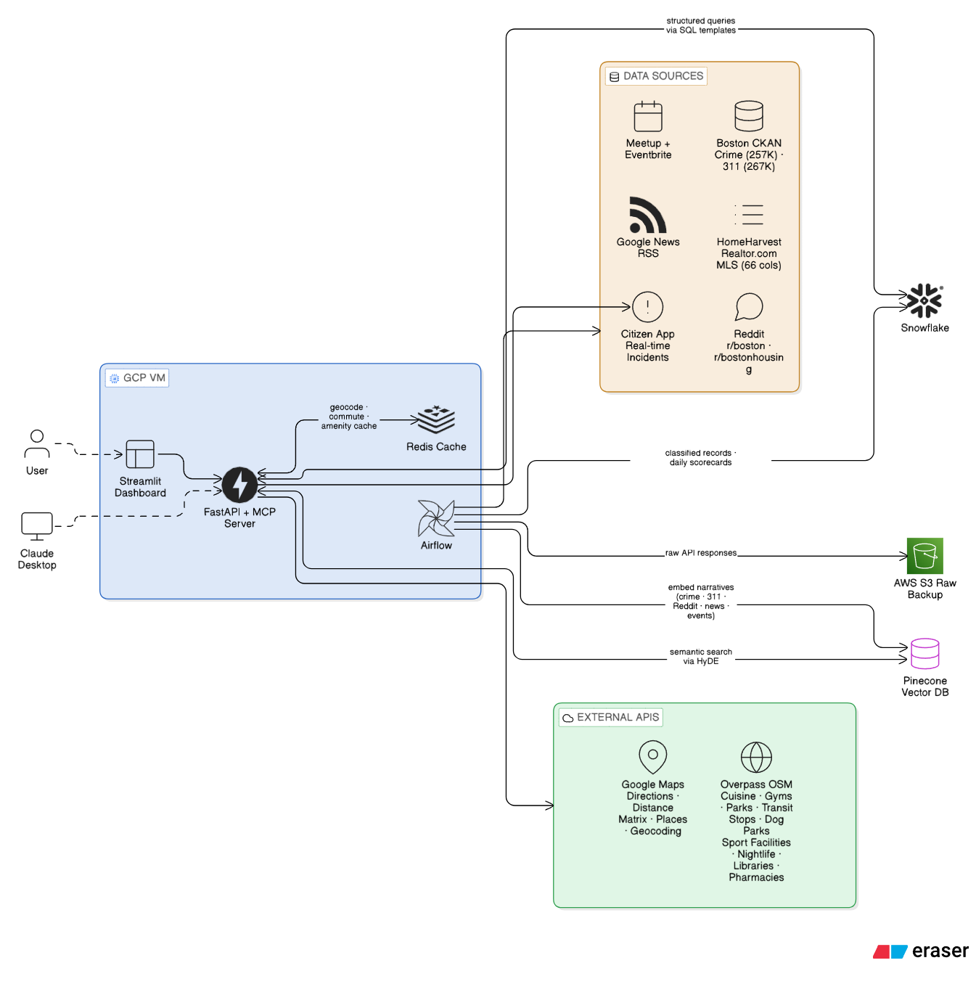
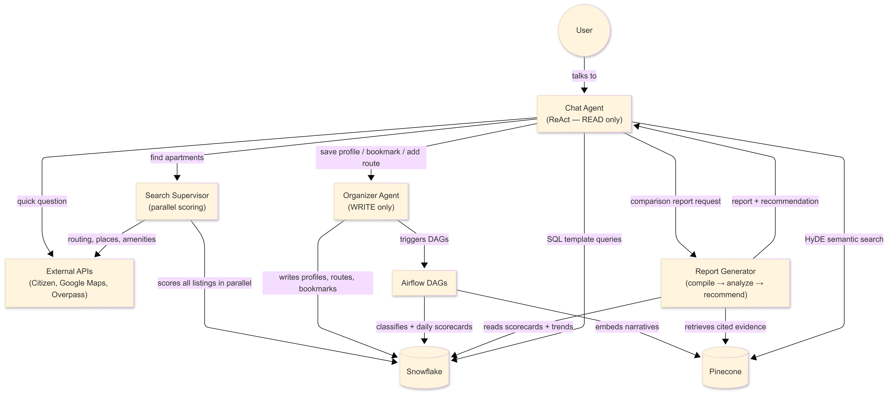
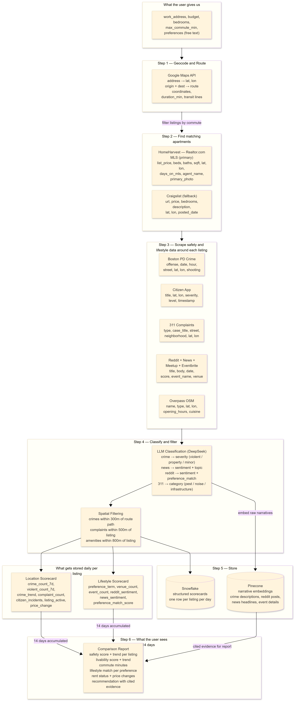

# Vicinity: Safe Intelligent Housing at Boston

| Resource | Link |
|----------|------|
| Main proposal doc | [Google docs](https://docs.google.com/document/d/1NcZYqf6dVZ_72SN9RxmF2KxyVSYjWUgFyUrR59dswoY/edit?tab=t.0#heading=h.ae6jx6ed91is) |
| Codelabs | [Codelabs Document](https://codelabs-preview.appspot.com/?file_id=https://docs.google.com/document/d/1C4EgqJ1iNbIH0LBLOLXK1bL2HbFNMgmnSNdpUlZiU9Q/edit?usp=sharing#0) |
| Video Presentation | [Video Demo](https://drive.google.com/file/d/1HOFUP1D8YVLnYSf_EePcSo5Fb55kANPw/view?usp=sharing) |

## DAMG 7245 — Big Data and Intelligent Analytics

**Team Members**

| Member | Contribution |
|--------|-------------|
| Anirudh Raj | 33.3% |
| Minal Naranje | 33.3% |
| Janhavi Patil | 33.3% |

**Attestation:** WE ATTEST THAT WE HAVEN'T USED ANY OTHER STUDENTS' WORK IN OUR ASSIGNMENT AND ABIDE BY THE POLICIES LISTED IN THE STUDENT HANDBOOK.

---

## 1. Introduction

### 1.1 Background

Every year, roughly 50,000 people move to Boston for work or school. They pick apartments from Craigslist or Zillow based on price, photos, and a Walk Score with no visibility into whether the commute route has had violent incidents at the hours they travel, whether the building has a history of 311 rodent complaints, or whether the neighborhood actually has the lifestyle amenities they care about.

Crime data, complaint records, transit schedules, community sentiment, and real-time incident feeds all exist as public data. But they are fragmented across 10+ sources with different schemas, update frequencies, and coordinate systems. No platform combines them into a spatial assessment tied to a specific person's routine and preferences.

### 1.2 Objective

Build a platform that takes a user's work address, budget, routine, and lifestyle preferences, finds apartment listings that fit, scores each listing across safety, livability, commute, and lifestyle dimensions using live public data, monitors the top candidates over a configurable watch period, and generates a comparison report recommending the best fit — backed by accumulated evidence and tradeoff analysis.

### 1.3 The Watch Period

- Bookmark 3–5 listings and set a watch period (1 week, 2 weeks, or a month)
- Airflow DAGs run daily pulling crime, 311 complaints, Citizen App events, Reddit/news mentions, and lifestyle-matched Meetup/
- Eventbrite activity for each listing
- Every day a scorecard row per listing is written to Snowflake; raw narratives get embedded into Pinecone for semantic retrieval
- When the watch period ends, the Report Generator reads the full scorecard history from Snowflake and pulls cited evidence from Pinecone
- It compares all listings across every dimension with trend lines and delivers a justified recommendation
- You decide based on weeks of accumulated evidence, not a single snapshot

Deliverables:
- Multi-source data ingestion pipeline (10 sources, Airflow-orchestrated)
- LLM-powered classification of crime severity, news sentiment, and lifestyle preference matching
- Dual-retrieval architecture: SQL templates for structured scorecard queries (Snowflake) + HyDE-enhanced semantic search for narrative evidence (Pinecone)
- LangGraph agentic workflow with parallel listing search, daily monitoring, and report generation
- MCP server for cross-client access with persistent user profiles
- Streamlit dashboard with interactive map and comparison reports

---

## 2. Project Overview

### 2.1 Scope

**In scope:**
- Apartment listing ingestion via HomeHarvest (Realtor.com MLS data) with Craigslist as fallback
- Safety scoring using crime incidents (Boston PD, Citizen App) filtered along actual commute routes
- Livability scoring using 311 complaint history near each listing
- Lifestyle matching using Overpass amenities, Meetup events, Google Places ratings, Reddit/News sentiment
- Commute computation via Google Maps Directions API (transit routing)
- Daily scorecard accumulation over a user-defined watch period
- Vector embedding of ingested narratives into Pinecone for semantic evidence retrieval
- LLM-generated comparison report with tradeoff analysis citing specific evidence
- MCP server wrapping all tools

**Out of scope:**
- Lease signing or payment processing
- Real-time push notifications (mobile)
- Multi-city expansion beyond Greater Boston

### 2.2 Stakeholders / End Users

Anyone searching for housing in Boston students, new hires, relocating professionals, healthcare workers with irregular schedules. The system is schedule-aware: a nurse working night shifts gets safety scoring filtered to 2 AM, not 2 PM.

---

## 3. Problem Statement

### 3.1 Current Challenges

- **Data fragmentation:** Crime data sits in Boston's CKAN portal, real-time incidents in Citizen App, complaints in a separate 311 dataset, transit in MBTA, amenities in OpenStreetMap. No platform merges them.
- **No route-level safety:** Existing platforms show neighborhood-level crime stats. A listing 500m from a dangerous corridor looks "safe" in aggregate. Our system scores the actual route the user walks or rides, at the hours they travel.
- **No temporal monitoring:** A listing might look fine today. Two weeks of daily data accumulation reveals a rising crime trend or new rodent complaints that a snapshot misses.
- **No lifestyle personalization:** "I like Korean food" is not a Zillow filter. The system needs to understand arbitrary lifestyle preferences and find matching venues, events, and community sentiment near each listing.
- **No narrative evidence:** Existing platforms reduce everything to numbers. A safety score of 72 tells you nothing about *what happened*. Users need to read the actual incident descriptions, Reddit discussions, and news coverage to make confident decisions — but no platform makes this searchable in natural language.

### 3.2 Opportunities

- 10 confirmed public data sources with live endpoints (validated with test scripts)
- LLM classification turns unstructured data (news headlines, Reddit posts, crime descriptions) into structured preference-matched signals
- Spatial filtering along route geometry (not just radius) provides safety assessment no existing platform offers
- Daily scorecard accumulation over a watch period gives temporal intelligence for confident decision-making
- Vector embedding of narrative data (crime descriptions, Reddit posts, news headlines) enables semantic retrieval — the user asks "has anything violent happened near this listing at night?" and gets cited evidence, not just a count

---

## 4. Methodology

### 4.1 Data Sources

| Source | Records | Update Frequency | Key Fields | API |
|--------|---------|-----------------|------------|-----|
| Boston PD Crime | 257,954 | Daily (1-2 day lag) | OFFENSE_DESCRIPTION, OCCURRED_ON_DATE, HOUR, STREET, Lat, Long, SHOOTING | CKAN datastore_search |
| 311 Complaints | 267,187 | Daily | type, open_dt, case_title, neighborhood, latitude, longitude | CKAN datastore_search |
| Citizen App | ~15-50 per query | Real-time (minutes) | title, latitude, longitude, severity, level, timestamp, address | Trending API (bbox) |
| HomeHarvest (Realtor.com) | ~900 per city query | On demand (MLS refresh) | list_price, beds, full_baths, sqft, street, city, zip_code, latitude, longitude, days_on_mls, mls_id, agent_name, primary_photo, text | `scrape_property()` Python API |
| Craigslist (fallback) | ~300 per search | Scraped Mon/Thu | url, price, bedrooms, description, lat, lon, address, posted_date | HTML scrape + parse |
| Google Maps | On demand | Real-time | duration_min, route coordinates, transit lines, distance | Directions + Distance Matrix + Geocoding + Places |
| Overpass (OSM) | ~160 per query | Monthly (cached) | name, type, lat, lon, opening_hours, cuisine, sport | Overpass QL |
| Reddit r/boston /similar threads | ~30 per query | Scraped daily | title, body, score, num_comments, created_date | JSON search endpoint |
| Google News | ~40-80 per query | Daily | headline, source_url, published_date | RSS feed |
| Meetup | ~40-140 per interest | Weekly | event_name, venue_name, date, group_name | Public search pages |
| Eventbrite | ~10 per query | Weekly | event_name, venue, date | Public search pages |

**Expected volume:** Under 1GB per month of accumulated data across all sources. Computation scales with users x candidate listings x data dimensions.

**HomeHarvest data quality note:** HomeHarvest pulls structured MLS data from Realtor.com 66 columns per listing including geocoordinates, price, beds/baths, sqft, days on market, agent contact, and photos. This eliminates the need for LLM-based feature extraction on listing descriptions (required with Craigslist) since fields arrive pre-structured. Craigslist is retained as a fallback for listings not on MLS (e.g., owner-listed rooms, short-term sublets).

### 4.2 Technology Stack

| Layer | Technology | Justification |
|-------|-----------|---------------|
| Cloud | GCP (VM + Cloud Storage) | Application images pushed to registries and pulled to servers with ease and on demand |
| Warehouse | Snowflake | Temporal queries on scorecards, GEOGRAPHY type for spatial |
| Vector Store | Pinecone | Semantic retrieval over unstructured narratives (crime descriptions, Reddit posts, news headlines, event details); complements SQL for structured scorecard queries |
| Raw Storage | AWS S3 | Raw API responses and scraped data stored before processing — enables replay if classification logic changes |
| Container Registry | GCP Artifact Registry | Docker images built by GitHub Actions, pulled by GCP VM |
| Cache | Redis | Geocode results, amenity queries, commute computations |
| Orchestration | Airflow (CeleryExecutor) | DAG scheduling hourly/daily/weekly per candidate listing |
| Agents | LangGraph | ReAct loop for Chat Agent, parallel graph for Search, sequential for Report |
| LLM | DeepSeek (primary) + GPT-4o (fallback) via LiteLLM | DeepSeek outperforms on template tasks at lower cost |
| Embeddings | OpenAI text-embedding-3-small | Low cost, 1536 dimensions, used for Pinecone vector writes and HyDE query embedding |
| API | FastAPI | REST endpoints + MCP SSE server |
| Frontend | Streamlit + Folium | Dashboard with interactive Leaflet maps |
| CI/CD | GitHub Actions | Automated testing + Docker build |
| Deployment | Docker Compose | Split containers: API, Airflow, Dashboard |

### 4.3 Architecture



### Agent Architecture

The system uses four components built on LangGraph, with a single entry point. The Chat Agent uses dual retrieval — SQL templates against Snowflake for structured data (scorecard numbers, crime counts, trends) and HyDE-enhanced semantic search against Pinecone for narrative evidence (incident descriptions, Reddit discussions, news coverage). This means the system can answer both "how many violent crimes happened near listing A this week?" (SQL) and "what are people saying about safety in Allston at night?" (Pinecone).

**Chat Agent (ReAct loop).** The only component the user interacts with. It receives every message, classifies intent, and routes accordingly. For structured queries ("how many crimes near this listing?", "what's the commute time?"), the Chat Agent selects a SQL template, queries Snowflake, and synthesizes a response. For open-ended queries ("what's the vibe of this neighborhood?", "is it sketchy walking home late near this place?", "show me things to do around my listings"), the Chat Agent generates a hypothetical answer (HyDE), embeds it, and retrieves semantically similar narratives from Pinecone — Reddit posts, news headlines, crime descriptions, event listings — then synthesizes a grounded response citing specific evidence. If the user wants to change something ("bookmark this listing"), it calls the Organizer. If the user wants to find apartments, it triggers the Search Supervisor. If the user wants the final comparison, it triggers the Report Generator. All responses flow back through the Chat Agent to the user.

**Organizer (write tools).** A set of functions with write access to Snowflake. Creates profiles, geocodes addresses via Google Maps, stores routine destinations, bookmarks candidate listings, and triggers Airflow DAGs. The Chat Agent invokes these the Organizer never talks to the user directly.

**Search Supervisor (LangGraph parallel graph).** Triggered once per listing search. Queries HomeHarvest for Realtor.com MLS listings matching the user's budget and bedroom requirements, filters by commute using Google Maps Distance Matrix, then fans out four scoring tasks in parallel across all surviving listings: safety (crime + Citizen along route corridors), livability (311 complaints near listing), amenities (Overpass within 800m), and lifestyle match (Meetup + Google Places + Overpass tags matched to user preferences). Fans in to a ranking step where the LLM explains why each listing scored the way it did.

**Report Generator (LangGraph sequential graph).** Triggered when the user asks for the comparison report after the watch period. Three steps: (1) compile all daily scorecards from Snowflake into a comparison matrix across all bookmarked listings, (2) LLM analyzes tradeoffs — weighs safety vs lifestyle vs commute against the user's stated priorities, identifies where dimensions conflict, flags trends, (3) LLM generates the final recommendation citing specific evidence retrieved from Pinecone — actual Reddit posts about the neighborhood, specific crime incident descriptions along the route, relevant news coverage — not just aggregate numbers.

**Airflow DAGs (background pipelines).** Not agents. Triggered by the Organizer when the user bookmarks listings, then run on schedule until the watch period ends. Five DAG types: ingest (fetches new data from all sources), classify (LLM tags each record with severity/sentiment/preference match via Pydantic-validated DeepSeek calls), embed (writes the raw narrative text with metadata to Pinecone — crime descriptions, Reddit posts, news headlines, 311 case titles, event details), scorecard (aggregates classified records into one row per listing per day in Snowflake), and listings (re-checks active listings for price changes and stale detection — HomeHarvest for MLS listings, Craigslist scrape for non-MLS fallback listings).

**MCP Server.** A FastAPI endpoint with SSE transport that exposes the Chat Agent as an invocable tool. Any MCP-compatible LLM client (Claude Desktop, a custom chatbot, or any application speaking the MCP protocol) connects with an API key, and the user's profile, bookmarked listings, and preferences are loaded from Snowflake automatically. The client sends a natural language query, the MCP server routes it to the Chat Agent, and the response streams back. Additionally, a small set of direct API tools are exposed for programmatic access: `search_listings`, `check_location`, `get_comparison_report`, and `add_destination` these bypass the Chat Agent and invoke the inner components (Search Supervisor, Report Generator, Organizer) directly when an LLM client already knows what it wants.

**System Architecture — Agent Interactions:**



*Four components: Chat Agent (user-facing, READ via SQL + Pinecone), Organizer Agent (WRITE), Search Supervisor (parallel scoring), Report Generator (compile → analyze → recommend with cited evidence). Airflow DAGs accumulate data on schedule. Structured data flows to Snowflake; narrative embeddings flow to Pinecone.*

**Data Flow — Field-Level Transformations:**



*Six stages: User input → Geocode & Route → Scrape (7 sources with exact fields) → Classify & Filter (LLM classification + spatial filtering) → Store (daily scorecards to Snowflake, narrative embeddings to Pinecone) → Output (comparison report with cited evidence and recommendation).*

### 4.4 Data Processing & Transformation

**Batch processing (Airflow DAGs):**
- Crime + 311: daily pull via CKAN `datastore_search`, paginated (1000 records/page), filtered by bounding box client-side, LLM classifies severity
- Citizen: hourly poll with tight bounding box per bookmarked listing, `limit=50`
- Reddit + News + Meetup + Eventbrite: weekly scrape, LLM classifies sentiment and preference match
- Listings: HomeHarvest query Mon/Thu per watched location (`past_days=3`), diff against stored listings for price changes and stale detection. Craigslist fallback scrape for non-MLS listings on the same schedule.

**Vector embedding (Pinecone):**
- After LLM classification, the embed DAG writes narrative text to Pinecone with metadata: `source` (crime/311/reddit/news/citizen/meetup/eventbrite), `lat`, `lon`, `timestamp`, `user_id`, `listing_lat`, `listing_lon`, `severity_llm` or `sentiment_llm` as applicable
- Embedding model: OpenAI `text-embedding-3-small` (1536 dimensions)
- Each record is one vector. Text is the raw narrative (e.g., crime offense description + street + hour, or Reddit post title + body)
- Pinecone namespace per user for isolation. Metadata filters narrow retrieval to relevant listings and time ranges
- HyDE at query time: the Chat Agent and Report Generator generate a hypothetical answer to the user's question, embed that answer, and retrieve the nearest real narratives from Pinecone. This bridges the vocabulary gap between conversational queries ("is it sketchy at night?") and stored records ("ASSAULT - AGGRAVATED, 11 PM, Tremont St")

**Spatial processing:**
- Google Maps returns route coordinates (list of lat/lon points following actual streets) for each listing-to-destination pair
- For each crime record: check if its lat/lon is within 300m of any point on the route path
- For 311 complaints: check if within 500m radius of the listing
- For amenities: Overpass query within 800m radius

**Scorecard aggregation (daily per listing):**
- Count crimes in past 7 days within corridors, compare to prior 7 days for trend (this can be configurable)
- Count 311 complaints by type (pest, noise, infrastructure)
- Aggregate lifestyle signals: venue count, event count, sentiment scores, preference match

**Storage schema:** Append-only. Every record has `ingested_at` timestamp. Scorecards are one row per listing per day in Snowflake. Narrative embeddings are append-only in Pinecone with the same `ingested_at` metadata. Historical data is never overwritten in either store.

### 4.5 LLM Integration Strategy

**Classification tasks (inside Airflow DAGs, DeepSeek primary):**

| Task | Input | Output |
|------|-------|--------|
| Crime severity | OFFENSE_DESCRIPTION text | `{severity: "violent" / "property" / "minor"}` |
| News sentiment | Headline + snippet | `{sentiment: str, topic: str, preference_match: bool}` |
| Reddit classification | Post title + body | `{sentiment: str, topics: list, preference_match: bool}` |
| 311 categorization | type + case_title | `{category: "pest" / "noise" / "infrastructure" / "other"}` |
| Listing feature extraction | Craigslist description (fallback listings only) | `{condition: str, amenities: list, pet_policy: str, red_flags: list}` |
| Preference expansion | User free text | `{overpass_tags: list, google_types: list, reddit_queries: list}` |

All classification outputs validated with Pydantic schemas. Failures logged, not stored.

**Note:** HomeHarvest listings arrive with structured fields (beds, baths, sqft, pet_policy, parking, description text) and do not require LLM feature extraction. The listing classification task above applies only to Craigslist fallback listings where the description is unstructured free text.

**Lifestyle Preference Pipeline.** The user states preferences in plain English "I like Korean food," "I need a gym," "I'm into live music." The LLM expands each preference into source-specific search terms: `cuisine=korean` for Overpass, `korean` as a keyword for Google Places, `"korean food allston"` for Reddit, `"Korean restaurants Boston"` for Google News, and relevant Meetup/Eventbrite categories. These expanded queries run against each source per candidate listing during the Search Supervisor's parallel scoring phase (for initial results) and again inside the weekly lifestyle DAG (for ongoing accumulation during the watch period). Results are aggregated into a preference match score per listing: how many matching venues within 800m, how many relevant events nearby, and whether community sentiment about that preference in the listing's neighborhood is positive or negative. The same pipeline handles any preference — "quiet for studying" inverts the signal (noise complaints become negative), "I have a dog" searches for dog parks and vet clinics, "I play tennis" queries `sport=tennis` in Overpass. The LLM is the universal translator between human language and API queries.

**Agentic workflows (LangGraph):**

- **Chat Agent:** ReAct loop. Receives user message, classifies intent into three paths: (1) structured data → SQL template against Snowflake, (2) open-ended / exploratory → HyDE embedding + Pinecone semantic search, (3) action → delegate to Organizer, Search Supervisor, or Report Generator. Synthesizes response from whichever path was taken.
- **Search Supervisor:** Parallel graph. search_node → commute_filter_node → [safety | livability | amenity | lifestyle] in parallel → rank_node with LLM synthesis.
- **Report Generator:** Sequential graph. compile_evidence (SQL from Snowflake + semantic retrieval from Pinecone) → analyze_tradeoffs (LLM with analyst prompt) → generate_report (LLM with writer prompt, cites specific evidence from Pinecone narratives).

### 4.6 Guardrails & Human-in-the-Loop

**Input validation:**
- The primary onboarding involves the chatbot asking users about their interests, requirements, routine, and frequently visited places before creating the respective zones to track the crime activity for them.
- Budget and bedrooms validated as numbers within reasonable ranges
- Addresses geocoded and confirmed with user before proceeding
- Preference expansions shown to user for approval before search

**Output validation:**
- All LLM outputs validated against Pydantic schemas
- SQL templates are pre-defined — the LLM selects templates, never writes raw SQL
- Pinecone retrieval results are filtered by metadata (user, listing, time range) before reaching the LLM — no cross-user data leakage

**HITL checkpoints:**
1. After onboarding: "Here are your destinations. Correct?" : user approves
2. After search: "Here are your candidates. Which to watch?" : user selects
3. After report: "Here is the recommendation. Pick or extend watch." : user decides

### 4.7 Evaluations & Testing

| What | How | Target |
|------|-----|--------|
| LLM classification accuracy | Golden set: 100 crimes, 50 headlines, 50 Reddit posts | >85% |
| Spatial query correctness | Unit tests with known coordinates | 100% pass |
| Scorecard consistency | Same input → same scorecard | 100% pass |
| Pinecone retrieval relevance | 50 test queries, manual relevance judgment on top-5 results | >80% relevant |
| HyDE vs direct embedding | A/B on retrieval quality for 30 conversational queries | HyDE wins on >70% |
| API | End-to-end: user query → response | End-to-end integration |
| DAG reliability | Task success rate over 14-day run | >95% |
| Report quality | Rubric: cites evidence, identifies tradeoffs, clear recommendation | Manual review |

Makefile to simulate autonomous deployment to GCP that can be integrated into GitHub Actions workflows later on.

### 4.8 Proof of Concept

POC implemented as a Streamlit app (`poc_routesafe.py`):

- Addresses entered as text, geocoded live (Nominatim or Google Maps)
- Routes computed via Google Maps Directions API (transit) or OSRM walking fallback
- Crime data fetched live from Boston PD CKAN (257K records, paginated)
- 311 complaints fetched live from Boston 311 CKAN
- Citizen App incidents fetched live via trending API
- Amenities fetched live from Overpass
- Routes scored by safety, map renders graph with routes colored by score
- Raw data overlay map with toggleable layers (crimes, 311, Citizen)
- Each source shown in separate tab with exact fields and scoring logic

All data fetched live. Zero hardcoded results.

---

## 5. Project Plan & Timeline

| Task | Owner | W1 | W2 | W3 |
|------|-------|----|----|-----|
| Airflow DAGs (crime, 311, Citizen) | Anirudh | ✓ | | |
| Airflow DAGs (Reddit, News, Meetup, Eventbrite) | Minal | ✓ | | |
| HomeHarvest listing pipeline + Craigslist fallback | Janhavi | ✓ | | |
| Snowflake schema + scorecard tables | Anirudh | ✓ | | |
| Pinecone index setup + embed DAG | Anirudh | ✓ | | |
| LLM classification pipeline (DeepSeek) | Minal | ✓ | | |
| Google Maps integration | Janhavi | ✓ | | |
| Chat Agent + SQL templates + HyDE retrieval | Anirudh | | ✓ | |
| Search Supervisor (parallel graph) | Minal | | ✓ | |
| Organizer Agent + Report Generator (with Pinecone evidence) | Janhavi | | ✓ | |
| MCP server + FastAPI | Anirudh | | ✓ | |
| Streamlit dashboard + map | Minal | | | ✓ |
| Comparison report UI | Janhavi | | | ✓ |
| Docker + GCP deployment | Anirudh | | | ✓ |
| Testing + evaluation + demo | All | | | ✓ |

---

## 6. Team Roles & Responsibilities

| Member | Role | Primary Ownership |
|--------|------|------------------|
| Anirudh Raj | Data + Infra Lead | Airflow DAGs, Snowflake schema, Pinecone setup, MCP server, GCP deployment, Chat Agent |
| Minal Naranje | LLM + Search Lead | Classification pipeline, Search Supervisor, social/lifestyle DAGs, Streamlit |
| Janhavi Patil | Integration Lead | Listing pipeline (HomeHarvest + Craigslist fallback), Google Maps routing, Organizer Agent, Report Generator |

---

## 7. Risks & Mitigation

| Risk | Mitigation |
|------|-----------|
| Citizen App API breaks (undocumented) | Fallback to Boston PD + Google News RSS |
| HomeHarvest / Realtor.com rate limiting | 3-5s delay between calls. Cache listings once fetched. ~10-20 req/min safe threshold. |
| Craigslist blocks scraping (fallback source) | Rate limit to 2x/week. Cache listings once scraped. Craigslist is fallback only — primary pipeline unaffected. |
| Google Maps free tier exceeded | Cache commute computations. Same route reused for weeks. |
| LLM classification errors | Pydantic enforcement. Failed validations excluded. Golden set >85%. |
| Pinecone free tier limits (namespaces, vector count) | One namespace per user. TTL-based cleanup of vectors older than 90 days. Estimated ~5K vectors/user/month — well within free tier. |
| Embedding API cost spike | Batch embed calls. Deduplicate before embedding (same crime record across users shares one vector with metadata). |

---

## 8. Expected Outcomes

**Multi-source data pipeline.** Airflow DAGs ingest from 10 validated Boston data sources into Snowflake and Pinecone on independent schedules (hourly for Citizen, daily for crime/311/news, weekly for Reddit/Meetup/Eventbrite, twice weekly for listings).

**Structured listing ingestion.** HomeHarvest returns 66 column MLS data per listing (price, beds, baths, sqft, geocoordinates, agent info, photos, days on market) — eliminating LLM-based feature extraction for the primary listing source.

**LLM classification with schema enforcement.** Every ingested record passes through DeepSeek with Pydantic-validated output — crime gets a severity tag, news gets sentiment + preference match, 311 gets a complaint category.

**Dual-retrieval architecture.** Structured scorecard data lives in Snowflake (SQL templates for counts, trends, aggregates). Raw narrative text lives in Pinecone as vector embeddings (semantic search for evidence, context, and open-ended exploration). The Chat Agent and Report Generator query both stores depending on the nature of the question.

**HyDE-enhanced semantic search.** When the user asks an open-ended question, the system generates a hypothetical answer, embeds it, and retrieves the nearest real narratives from Pinecone. This bridges the vocabulary gap between conversational queries and stored records — "is it dangerous at night?" retrieves "ASSAULT - AGGRAVATED, 11 PM, Tremont St" even though no words overlap.

**Daily scorecard computation.** One Snowflake row per listing per day aggregating crime count along route corridors, complaint density near the listing, and lifestyle match score against user preferences.

**LangGraph agentic workflow.** Chat Agent (ReAct loop with dual retrieval for all user queries), Search Supervisor (parallel scoring across candidate listings), Report Generator (compile evidence from both stores → analyze tradeoffs → cited recommendation).

**MCP server with persistent context.** FastAPI + SSE endpoint user authenticates once, any MCP-compatible LLM client gets their profile, routes, and preferences pre-loaded without re-explaining.

**HITL at decision points.** User approves geocoded locations before search, approves the watch set before DAGs trigger, and reviews the comparison report before picking a listing.

**Map-based visualization.** Streamlit + Folium renders route graphs colored by safety score, crime/complaint/Citizen markers along corridors, lifestyle venues, and a side-by-side comparison view across bookmarked listings.

---

## 9. Token & Cost Report

| Task | Calls/day | Tokens/call | Daily cost (DeepSeek) |
|------|-----------|------------|----------------------|
| Crime classification | ~50 | ~200 | $0.01 |
| News classification | ~40 | ~300 | $0.01 |
| Reddit classification | ~10 (weekly) | ~500 | <$0.01 |
| Vector embedding (all sources) | ~100 | ~300 | $0.002 (OpenAI embed) |
| HyDE query generation | ~5 | ~200 | $0.001 |
| Report generation | On demand | ~3000 | $0.02 |

**Estimated total: <$1/user for a full 14-day monitoring cycle.**

Optimization: DeepSeek primary (10x cheaper than GPT-4o), Pydantic schema enforcement, cache duplicate classifications, batch embeddings, deduplicate vectors across users where possible.

---

## 10. Conclusion

Vicinity combines 10 public data sources into a spatial intelligence layer that answers "where should I live" with evidence accumulated over time, personalized to the user's routine and lifestyle. The technical differentiators are route-level safety scoring — filtering crime data along the exact path the user would walk or ride, at the hours they travel — and dual-retrieval architecture that lets users ask natural language questions and get answers grounded in real incident reports, community discussions, and news coverage, not just aggregate scores. No existing housing platform does either.

---

## 11. References

- Boston PD Crime Incidents: [data.boston.gov](https://data.boston.gov/dataset/crime-incident-reports-august-2015-to-date)
- Boston 311 Service Requests: [data.boston.gov](https://data.boston.gov/dataset/311-service-requests)
- Citizen App API: `citizen.com/api/incident/trending`
- HomeHarvest (Realtor.com scraper): [github.com/ZacharyHampton/HomeHarvest](https://github.com/ZacharyHampton/HomeHarvest)
- Google Maps Platform: [developers.google.com/maps](https://developers.google.com/maps)
- Overpass API: [overpass-api.de](https://overpass-api.de)
- Reddit API: [reddit.com/dev/api](https://www.reddit.com/dev/api)
- Google News RSS: [news.google.com/rss](https://news.google.com/rss)
- Meetup: [meetup.com](https://www.meetup.com)
- Eventbrite: [eventbrite.com](https://www.eventbrite.com)
- LangGraph: [langchain-ai.github.io/langgraph](https://langchain-ai.github.io/langgraph)
- Craigslist Boston (fallback): [boston.craigslist.org/search/apa](https://boston.craigslist.org/search/apa)
- Pinecone: [pinecone.io](https://www.pinecone.io)
- HyDE (Hypothetical Document Embeddings): [arxiv.org/abs/2212.10496](https://arxiv.org/abs/2212.10496)

---

## Appendix

### A. Sample Snowflake Schema

```sql
student_profiles (user_id, anchor_address, anchor_lat, anchor_lon, budget, bedrooms, max_commute_min, preferences, created_at)

routine_nodes (node_id, user_id, name, address, lat, lon, visit_days, visit_hour, node_type)

route_edges (edge_id, user_id, origin_node_id, dest_node_id, route_coords, duration_min, distance_m, mode, transit_lines)

candidate_watches (watch_id, user_id, listing_url, listing_lat, listing_lon, listing_price, watch_start, watch_end, active)

crimes (incident_number, offense_description, occurred_on_date, hour, street, district, lat, lon, shooting, severity_llm, source, ingested_at)

complaints (case_id, open_dt, type, category_llm, street_address, neighborhood, lat, lon, ingested_at)

listings (listing_id, property_url, source, list_price, beds, full_baths, sqft, street, city, zip_code, lat, lon, mls_id, days_on_mls, agent_name, primary_photo, description, features_llm, first_seen, last_seen, times_seen)

news_classified (headline_hash, headline, source_url, sentiment_llm, topic_llm, preference_match, published_at, ingested_at)

reddit_classified (post_id, title, body, score, sentiment_llm, topics_llm, preference_match, created_at, ingested_at)

meetup_events (event_id, event_name, venue_name, lat, lon, event_date, group_name, ingested_at)

location_scorecards (user_id, listing_lat, listing_lon, score_date, crime_count_7d, violent_count_7d, crime_trend, complaint_count, complaint_types, citizen_incidents_24h, listing_active, price_change)

lifestyle_scorecards (user_id, listing_lat, listing_lon, score_date, preference_term, venue_count, event_count, sentiment_score, preference_match_score)
```

**Note on Pinecone:** Pinecone is a managed vector database and does not use SQL schemas. Each vector is stored with the following metadata structure for filtering at query time:

```
vector_id:      "{source}_{record_id}"
text:           raw narrative (e.g., "ASSAULT - AGGRAVATED, Tremont St, 11 PM")
metadata: {
    source:         "crime" | "311" | "reddit" | "news" | "citizen" | "meetup" | "eventbrite"
    user_id:        "user_123"
    listing_lat:    42.3412
    listing_lon:    -71.0698
    lat:            42.3398
    lon:            -71.0685
    timestamp:      "2026-04-01T23:00:00Z"
    severity_llm:   "violent"          // crime only
    sentiment_llm:  "negative"         // reddit/news only
    preference_match: true             // lifestyle sources only
    ingested_at:    "2026-04-02T06:00:00Z"
}
namespace:      "user_123"
```

### B. Sample Classification Prompt

```
You are a crime severity classifier. Given a crime offense description, classify its severity.
Respond with ONLY valid JSON, no preamble:
{"severity": "violent" | "property" | "minor"}

Rules:
- violent: assault, robbery, shooting, homicide, stabbing, firearm, weapon
- property: burglary, auto theft, breaking and entering, larceny, vandalism
- minor: verbal dispute, trespassing, disorderly conduct, investigate person

Input: "ASSAULT - AGGRAVATED"
```

### C. HomeHarvest Sample Response

A single `scrape_property(location="Boston, MA", listing_type="for_rent", past_days=7)` call returns a DataFrame with 66 columns. Key fields per listing:

```
property_url:    https://www.realtor.com/rentals/details/88-Wareham-St-Unit-307_Boston_MA_02118_M90459-27380
property_id:     9045927380
listing_id:      2993270277
mls:             HELN
mls_id:          09f084a1-5c6a-434b-9f13-b14c593315ee
status:          FOR_RENT
list_price:      3200
beds:            2
full_baths:      1
sqft:            850
street:          88 Wareham St
unit:            Unit 307
city:            Boston
state:           MA
zip_code:        02118
latitude:        42.3412
longitude:       -71.0698
days_on_mls:     12
list_date:       2026-03-24 00:00:00
agent_name:      John Smith
agent_email:     john@example.com
primary_photo:   https://ap.rdcpix.com/...
text:            "Sunny 2BR in South End..."
```

Tested April 5, 2026: 900 listings returned for Boston, 2,504 unique listings across Boston/Cambridge/Somerville/Brookline after deduplication.

### D. HyDE Retrieval Example

**User query:** "Is it safe to walk home late at night near the Allston listing?"

**Step 1 — HyDE generates a hypothetical answer:**
"Walking home late at night near Allston can be risky. There have been reports of assaults and robberies along Commonwealth Ave and Brighton Ave after midnight, particularly near bars and transit stops."

**Step 2 — Hypothetical answer is embedded** using `text-embedding-3-small` → 1536-dimension vector

**Step 3 — Pinecone retrieves nearest real narratives** (filtered by `listing_lat/lon` near Allston, `source` in [crime, citizen, reddit]):
1. "ROBBERY - STREET, Brighton Ave, 1 AM" (crime, severity: violent)
2. "Person assaulted near Allston T stop late night" (citizen, severity: high)
3. "I live in Allston and honestly avoid walking down Harvard Ave past midnight" (reddit, sentiment: negative)

**Step 4 — Chat Agent synthesizes response** grounded in the retrieved evidence, citing each source.

## Proof of Concept

The repository includes a working Streamlit app and data validation scripts that confirm every source endpoint returns usable data.

### Running the POC
```bash
pip install streamlit folium streamlit-folium requests pandas homeharvest
streamlit run poc.py
```

Optionally set `GOOGLE_MAPS_KEY` as an environment variable for transit routing and Google Places data. Without it, the app falls back to Nominatim geocoding and OSRM walking routes.
```bash
# With Google Maps (transit routing enabled)
set GOOGLE_MAPS_KEY=your_key_here   # Windows
export GOOGLE_MAPS_KEY=your_key_here  # Mac/Linux
streamlit run poc.py
```

The app takes a listing address and destinations as plain text in the sidebar, geocodes everything live, computes routes, fetches crime data from Boston PD (257K records, paginated), 311 complaints, Citizen App real-time incidents, and Overpass amenities, then scores each route corridor for safety and renders the full route graph on a Folium map. A second map shows all raw incidents as toggleable layers. Each data source is shown in a separate tab with exact fields and how they feed into the scoring. Zero hardcoded results.

### Running the data validation scripts
```bash
pip install httpx requests homeharvest
python inspect_data.py
python test_student_housing.py
python test_listing_sources.py
python test_lifestyle_search.py
```

`inspect_data.py` prints exact fields, record counts, date ranges, and coordinate coverage for every source. `test_student_housing.py` validates all primary endpoints. `test_listing_sources.py` tests listing APIs (HomeHarvest for Realtor.com MLS data, Craigslist fallback, expanded Overpass). `test_lifestyle_search.py` tests the general web search pipeline (Google News, Meetup, Eventbrite, Reddit lifestyle queries, dynamic Overpass queries). These scripts confirmed what works and what returns 403 — the data source table in this README is based entirely on their output.
